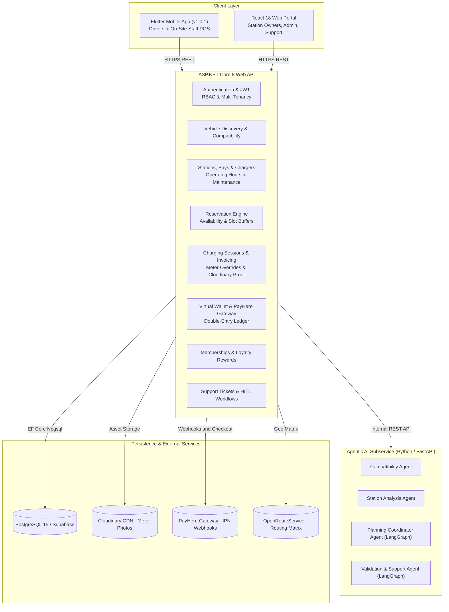

# ChargeSync
### Intelligent EV Charging Reservation, Recommendation & Settlement Platform

[](https://github.com/Naviya2/ChargeSync-Platform/actions)
[](https://chargesync-platform.vercel.app/)
[](https://chargesync-platform-backend.onrender.com)
[](https://chargesync-platform-agentic-ai.onrender.com)
[](https://dotnet.microsoft.com/)
[](https://www.postgresql.org/)
[-02569B?logo=flutter)](https://github.com/Naviya2/ChargeSync-Platform/releases/download/v1.0.1/ChargeSync_v1.0.1.apk)
[](#10-testing)

> **SE3090 – Software Engineering Frameworks** · BSc (Hons) in Software Engineering · SLIIT · Year 3, Semester 1, 2026

---

### 🌐 Live Deployments & Cloud Environments

| Service | Hosting Platform | Live URL | Endpoints & Health |
|---|---|---|---|
| **Frontend Web Portal** | Vercel | [https://chargesync-platform.vercel.app/](https://chargesync-platform.vercel.app/) | Production React 18 Admin, Station Owner & Support Dashboard |
| **Backend REST API** | Render | [https://chargesync-platform-backend.onrender.com](https://chargesync-platform-backend.onrender.com) | [Swagger UI Documentation](https://chargesync-platform-backend.onrender.com/swagger) |
| **Agentic AI Microservice** | Render | [https://chargesync-platform-agentic-ai.onrender.com](https://chargesync-platform-agentic-ai.onrender.com) | [Health Check Endpoint](https://chargesync-platform-agentic-ai.onrender.com/health) |
| **Driver / Station Owner Mobile App** | Android APK | [Download ChargeSync_v1.0.1.apk](https://github.com/Naviya2/ChargeSync-Platform/releases/download/v1.0.1/ChargeSync_v1.0.1.apk) | Standalone pre-built release artifact (v1.0.1) · [Local mirror](mobile-flutter/ChargeSync_v1.0.1.apk) |

---

## 1. Project Overview

**ChargeSync** is an end-to-end intelligent electric vehicle (EV) charging reservation, recommendation, and operational platform connecting EV drivers, charging station owners, platform administrators, and customer support representatives into a single, cohesive ecosystem.

Instead of drivers hunting for compatible charging equipment, guessing availability, or encountering broken hardware on arrival, ChargeSync orchestrates a multi-agent **Agentic AI subsystem** behind a secure backend. The AI assesses vehicle-to-charger hardware compatibility, analyzes real-time station occupancy and tariffs, and synthesizes ranked, multi-step charging itineraries tailored to driver objectives (deadline, distance, cost optimization) — with mandatory **Human-in-the-Loop (HITL)** governance on any actions exceeding strict business safety thresholds.

The platform is designed around a **hybrid operational model** specifically tailored to emerging EV markets featuring varied smartphone digital literacy, absence of direct IoT vehicle-to-charger telemetry, and prevalent on-site cash payments. ChargeSync addresses this through:
- **Dual-mode Flutter Mobile App (v1.0.1)** for drivers (discovery, AI planning, booking, QR check-in, wallet) and station staff (on-site POS, walk-in admission, physical meter photo verification via Cloudinary, cash settlement).
- **Responsive React Admin/Owner Portal** for station/charger/bay lifecycle management, 7-day operating hours, pending station reviews, support inbox workflows, and HITL approval gates.
- **ASP.NET Core 8 Web API** delivering clean architectural modularity, robust PostgreSQL transactional integrity, double-entry virtual ledger management, and PayHere payment gateway integration.
- **Python LangGraph AI Microservice** isolated behind internal network boundaries with HMAC authentication.

---

## 2. Key Recent Updates & New Capabilities (v1.0.1)

- **Station Bay Management Subsystem**: Added physical parking and charging bay management (`Bay` entity, schema migrations, and REST endpoints). Station owners can now define, organize, and assign chargers to specific physical bays through the React portal.
- **Driver Self-Service Reservation Editing**: Drivers can now modify reservation time windows directly from the mobile app (`EditReservationTimeScreen`), with server-side validation preserving slot exclusivity and buffer constraints.
- **Mobile QR Scanner Engine Overhaul**: Re-architected mobile camera lifecycle handling and scanner event pipeline, eliminating mounting freezes and replacing duplicate-detection lockups with real-time continuous debounced scanning.
- **Mobile UI & Cross-Platform Branding**: Released **`ChargeSync_v1.0.1.apk`** with refreshed, high-resolution launcher icons for Android and iOS, unified vector brand assets, and responsive `Wrap` layouts resolving button overflow on compact screens.
- **PayHere Payment Gateway & Wallet Top-Up**: Integrated PayHere hosted checkout via short-lived capability tickets, asynchronous Instant Payment Notification (IPN) webhook verification, and automated wallet ledger balance updates.
- **Human-in-the-Loop (HITL) Security Enforcement**: Hardened workflow boundaries preventing non-administrative roles from approving financial refunds; added fallback sanitization for AI provider degradation.
- **Comprehensive End-to-End (E2E) Test Framework**: Playwright and Flutter integration test runners covering station registration, bay configuration, driver booking, session checkout, and administrative workflow approval.
- **Sustained API Performance & Load Testing**: Implemented k6 load testing suites measuring P95 latency (sub-500ms target), error rates (<1%), and virtual user scaling across sequential load phases.

---

## 3. User Roles & Capabilities

| Role | Client Interface | Core Capabilities |
|---|---|---|
| **EV Driver** | Flutter Mobile App | • Registers and manages EV profiles (make, model, connector, battery, max charge rate)<br>• Discovers nearby stations with real-time hardware compatibility scoring<br>• Generates AI multi-step charging plans optimized by time, distance, or tariff<br>• Reserves charging bays up to 7 days in advance with virtual wallet pre-authorization<br>• Self-edits upcoming reservation time slots before check-in<br>• Dynamic QR check-in at station bays<br>• Virtual wallet top-up via PayHere gateway, ledger transaction auditing<br>• Subscribes to membership tiers, earns and redeems loyalty points<br>• Submits customer support tickets with linked invoice/session records |
| **Station Owner / On-Site Staff** | React Web Portal & Flutter POS | • Registers charging stations with GPS coordinates, amenities, and photos<br>• Manages physical charging bays and assigns chargers<br>• Configures chargers (connector type, kW rating, pricing tariff, status)<br>• Defines weekly 7-day operating hours and schedules charger maintenance downtime<br>• On-site Flutter POS: Scans driver QR codes for instant check-in<br>• Admits walk-in drivers without prior reservations<br>• Records initial and final physical meter readings with Cloudinary photographic proof<br>• Stops sessions and collects cash or wallet settlements |
| **Platform Administrator** | React Web Portal | • System-wide user and vehicle CRUD governance across all tenants<br>• Moderates pending station registrations with mandatory audit reason logging<br>• Inspects meter override discrepancies (>15% variance fraud detection)<br>• Reviews and approves high-value reward redemptions (>5,000 points / $50)<br>• Exercises Human-in-the-Loop (HITL) approval gates for agent-proposed refunds (>LKR 4,500 / $15) |
| **Customer Support Manager** | React Web Portal | • Manages support workspace and triages incoming driver tickets<br>• Evaluates AI Support Agent sentiment analysis, root cause findings, and policy checks<br>• Investigates billing discrepancies and triggers refund workflows |

---

## 4. Core Business Components



### Component Breakdown
1. **Vehicle & AI Compatibility Discovery**: Driver vehicle inventory, platform administrator system-wide vehicle management, connector pinout matching (Type 2, CCS2, CHAdeMO, NACS, GB/T), power bottleneck analysis, and nearby compatible station queries.
2. **Station, Bay, Charger & Operating-Hours Management**: Station registration and moderation lifecycle, physical bay management, charger technical configuration with optional status overrides, 7-day operating hours schedules, scheduled maintenance windows, spatial proximity search, and real-time charger availability calculation.
3. **Reservation Engine & AI Charging Planning**: Conflict-free advance bookings with wallet pre-authorization, 15-minute slot buffer enforcement, driver self-service time slot updates, dynamic QR token generation, staff QR check-in, on-site walk-in admission, and multi-agent AI charging itineraries tailored to driver objectives.
4. **Session, Payment, Loyalty & Support Management**: Dual-layer hybrid telemetry (calculated baseline vs. staff physical meter override with Cloudinary photographic evidence), 15% fraud discrepancy detection, automated invoice generation, virtual wallet ledger with PayHere hosted checkout and IPN handling, tiered memberships, loyalty points accrual and redemption, support ticket triage, and LangGraph-driven HITL refund gating.

---

## 5. Agentic AI Subsystem

Four distinct autonomous agents orchestrate complex decisions using **LangGraph** and **FastAPI**, communicating exclusively with the ASP.NET Core backend via constant-time internal token verification (`X-Agent-Service-Key`):

| Agent | Architecture | Responsibility & Boundaries |
|---|---|---|
| **Vehicle Compatibility Agent** | Deterministic + LLM Fallback | Evaluates connector hardware matching, maximum vehicle charge acceptance vs. charger output, detects charging bottlenecks, and recommends hardware adapters or compatible alternative chargers. |
| **Station Analysis Agent** | Multi-Factor Scoring Pipeline | Evaluates real-time charger availability, pricing tariffs, station amenities, and historical reliability to return weighted candidacy scores to the planning coordinator. |
| **Charging Recommendation & Planning Agent** | LangGraph State Graph Coordinator | Deconstructs driver constraints (deadline, budget, speed), queries compatibility and station analysis agents, generates candidate plans, and synthesizes a ranked charging itinerary. Automatically flags urgency or buffer conflicts for human approval. |
| **Validation & Support Agent** | Bounded LangGraph Workflow | Ingests support inquiries, performs sentiment analysis and root-cause classification, cross-examines session meter readings against generated invoices, and formulates refund proposals. Restricts tools to bounded read-only inspection. |

### Human-in-the-Loop (HITL) Governance
To eliminate financial and operational risks of autonomous AI actions, execution transitions into a persistent `PendingApproval` state requiring manual review in the React portal when:
- Proposed customer refund exceeds **LKR 4,500 (~$15.00 USD)**.
- Loyalty reward redemption exceeds **5,000 points** or **$50.00 value**.
- AI charging itinerary detects buffer conflicts or urgency overrides requiring station owner confirmation.
- Staff physical meter override differs from baseline calculation by **> 15%**.
- Non-administrative users (such as drivers) are strictly prohibited from approving workflows.

---

## 6. Technology Stack

| Layer | Technologies & Libraries |
|---|---|
| **Backend API** | ASP.NET Core Web API (C# 12, .NET 8 LTS), Entity Framework Core 8, Npgsql, BCrypt.Net, System.IdentityModel.Tokens.Jwt |
| **Database** | PostgreSQL 15 (Supabase Session Pooler supported), relational integrity, B-Tree & composite indexing, EF Core Migrations |
| **Agentic AI** | Python 3.11 / 3.12, FastAPI, LangGraph, LangChain Core, Pydantic v2, Groq API (`openai/gpt-oss-120b` / `llama3.2`) with Ollama local fallback |
| **Web Portal** | React 18, Vite, React Router v6, TanStack Query (React Query v5), Zustand, Lucide Icons, Tailwind-free Vanilla CSS |
| **Mobile App** | Flutter 3.x (Dart 3), Flutter Riverpod, mobile_scanner, qr_flutter, http, shared_preferences, Android Gradle Build Tools |
| **Media & Storage** | Cloudinary CDN (meter photo evidence uploads and verification) |
| **Payments** | PayHere Hosted Payment Gateway, MD5/HMAC verification, Instant Payment Notification (IPN) webhooks |
| **Geospatial & Routing** | OpenRouteService (Distance Matrix & Turn-by-Turn Routing), Haversine spatial calculation |
| **E2E & Load Testing** | Playwright, k6 (sustained load testing), Flutter Drive / integration_test |
| **Unit & Integration Testing** | xUnit, Moq, WebApplicationFactory, pytest, anyio, Vitest, React Testing Library, flutter_test |
| **CI/CD & DevOps** | GitHub Actions workflows, Docker multi-stage containerization, Render, Vercel |

---

## 7. Repository Structure

```
ChargeSync-Platform/
├── backend/                       # ASP.NET Core Web API (.NET 8)
│   ├── src/Api/                   # Controllers, middleware, authentication handlers
│   ├── src/Application/           # CQRS-lite services, interfaces, DTOs, business rules
│   ├── src/Domain/                # Entities (Bay, Charger, Station, Reservation, Session, etc.)
│   ├── src/Infrastructure/        # EF Core DbContext, PostgreSQL migrations, Cloudinary/PayHere
│   ├── src/AgentClient/           # Typed HTTP client to internal Python AI microservice
│   └── tests/
│       ├── UnitTests/             # 219 xUnit unit tests (21 test classes)
│       └── IntegrationTests/      # 49 xUnit integration tests (WebApplicationFactory)
├── agentic-ai/                    # Python LangGraph AI microservice (internal only)
│   ├── agents/                    # Compatibility, Station Analysis, Planning & Support agents
│   ├── tools/                     # Bounded read-only tools for agents
│   ├── models/                    # Pydantic schemas and graph state contracts
│   └── tests/                     # 31 pytest tests across 7 test suites
├── web-react/                     # React 18 admin/owner/support dashboard (Vite)
│   ├── src/features/              # Stations (with Bays), Chargers, Reservations, Support, Users
│   ├── src/components/            # Shared UI components, modals, ImageUploader
│   ├── src/store/                 # Zustand global auth and layout state
│   └── tests/                     # 72 Vitest + React Testing Library tests (20 suites)
├── mobile-flutter/                # Flutter mobile app (Driver + Station Staff POS)
│   ├── lib/features/              # Auth, vehicles, stations, reservations, checkout, wallet
│   ├── lib/core/                  # Theme, routing, API clients, token storage
│   ├── build/app/outputs/flutter-apk/ # Generated ChargeSync_v1.0.1.apk
│   └── test/                      # 68 flutter_test tests across 14 suites
├── database/                      # Database schema and test scripts
│   └── tests/                     # Directory for 6 PostgreSQL SQL test suites + Python runner
├── e2e/                           # End-to-End automated testing framework directory
│   ├── stations/                  # Playwright station registration & approval E2E
│   ├── reservation_e2e/           # Driver reservation planning E2E runner
│   ├── run.mjs / Run.ps1          # Multi-tier full stack workflow E2E test runner
│   └── Start-Backend.ps1          # Isolated E2E test server launchers
├── performance/                   # Performance & load testing framework directory
│   ├── run-sustained.mjs          # Sustained k6 API load test runner (P95 < 500ms target)
│   ├── station-api-load.js        # Station API load scenario script
│   └── Run.ps1                    # PowerShell sustained load execution script
├── nfr-tests/                     # Non-Functional Requirement testing suites directory
│   ├── availability/              # Availability test scripts & reports
│   ├── compatibility/             # Cross-platform compatibility test suite
│   ├── performance/               # API latency & throughput verification
│   └── security/                  # Security, RBAC & penetration test runners
├── docs/                          # Authoritative project documentation & reports
│   ├── group-report/              # ChargeSync Final Report PDF & SRS v2.0
│   └── individual-reports/        # Individual student contribution reports
└── .github/workflows/             # CI/CD pipelines (backend, web, mobile, linting)
```

---

## 8. Getting Started

### 8.1 Prerequisites
- **.NET SDK 8.0+**
- **Node.js 22+ & npm**
- **Flutter SDK 3.x** (with Android Studio / Android SDK for mobile builds)
- **Python 3.11+ / 3.12**
- **PostgreSQL 15+** (local or hosted Supabase project)
- **k6** (optional, for running performance tests)
- **Google Chrome** (for Playwright E2E testing)

### 8.2 Recommended Startup Sequence
1. Start PostgreSQL database and apply migrations.
2. Launch Python Agentic AI microservice (`localhost:8000`).
3. Launch ASP.NET Core backend API (`localhost:5035` or `5001`).
4. Launch React Web Portal (`localhost:5173`) and/or Flutter Mobile App.

---

### 8.3 Backend Setup (ASP.NET Core)
```bash
cd backend
cp appsettings.Example.json appsettings.Development.json
# Configure your PostgreSQL connection string in appsettings.Development.json

dotnet restore
dotnet ef database update --project src/Infrastructure --startup-project src/Api
dotnet run --project src/Api
```
- API Base URL: `http://localhost:5035` (or configured HTTPS port)
- Swagger UI Documentation: `http://localhost:5035/swagger`

---

### 8.4 Agentic AI Subsystem Setup (Python + LangGraph)
```bash
cd agentic-ai
python -m venv venv

# Windows
venv\Scripts\activate
# Linux/macOS
source venv/bin/activate

pip install -r requirements.txt
cp .env.example .env
# Set LLM_PROVIDER=groq (with GROQ_API_KEY) or LLM_PROVIDER=ollama (with local ollama serve)

uvicorn main:app --reload --port 8000
```
- Internal Health Check: `http://localhost:8000/health`

---

### 8.5 Web Portal Setup (React + Vite)
```bash
cd web-react
cp .env.example .env.local
# Set VITE_API_BASE_URL=/api

npm install
npm run dev
```
- Web Application: `http://localhost:5173`

---

### 8.6 Mobile App Setup (Flutter)
```bash
cd mobile-flutter
cp .env.example .env
# Set API_URL=http://10.0.2.2:5035 for Android Emulator, or http://<YOUR_IP>:5035 for physical device

flutter pub get
flutter run
```
To generate the release APK directly:
```bash
flutter build apk --release
# Output: build/app/outputs/flutter-apk/app-release.apk
```
*Note: A verified pre-built release artifact is available for download at [GitHub Release Download (ChargeSync_v1.0.1.apk)](https://github.com/Naviya2/ChargeSync-Platform/releases/download/v1.0.1/ChargeSync_v1.0.1.apk) (local repository mirror: [`mobile-flutter/ChargeSync_v1.0.1.apk`](mobile-flutter/ChargeSync_v1.0.1.apk)).*

---

## 9. Environment Variables Configuration

### 9.1 Backend (`backend/src/Api/appsettings.json`)
| Key | Type | Default / Example | Purpose |
|---|---|---|---|
| `ConnectionStrings:Postgres` | String | `Host=localhost;Port=5432;Database=chargesync;Username=postgres;Password=...` | Relational PostgreSQL database connection |
| `Jwt:Key` | String | *Min 32-character secret* | HMAC-SHA256 signing secret for JWT tokens |
| `Jwt:Issuer` | String | `ChargeSync` | Token issuer validation claim (`iss`) |
| `Jwt:Audience` | String | `ChargeSync` | Token audience validation claim (`aud`) |
| `Jwt:AccessTokenMinutes` | Integer | `60` | Lifespan of JWT access token before expiration |
| `Jwt:RefreshTokenDays` | Integer | `30` | Lifespan of database-persisted refresh token |
| `Groq:ApiKey` | String | `gsk_...` | Groq Cloud API key for fast inference |
| `AGENT_SERVICE_BASE_URL` | String | `http://localhost:8000` | Internal URL of Python LangGraph service |
| `AGENT_SERVICE_API_KEY` | String | *Shared Secret* | Verified via `X-Agent-Service-Key` header |
| `OpenRouteService:ApiKey` | String | *ORS Token* | OpenRouteService token for distance matrix routing |
| `PayHere:Enabled` | Boolean | `true` | Toggles active PayHere payment integration |
| `PayHere:Sandbox` | Boolean | `true` | Selects PayHere Sandbox vs. Production environment |
| `PayHere:MerchantId` | String | `1234567` | PayHere registered merchant account ID |
| `PayHere:MerchantSecret` | String | *Secret* | PayHere secret for MD5 hash validation |
| `PayHere:PublicBaseUrl` | String | `https://api.chargesync.example` | Public hostname for IPN webhook reception |
| `Cloudinary:CloudName` | String | `chargesync-cdn` | Cloudinary account cloud identifier |
| `Cloudinary:ApiKey` | String | `1234567890` | Cloudinary REST API key |
| `Cloudinary:ApiSecret` | String | *Secret* | Cloudinary REST API secret |
| `SupportWorkflow:RefundApprovalThresholdLkr` | Decimal | `4500.00` | Maximum autonomous refund before HITL approval |

### 9.2 Agentic AI (`agentic-ai/.env`)
| Key | Type | Default / Example | Purpose |
|---|---|---|---|
| `LLM_PROVIDER` | String | `groq` (or `ollama`) | Active LLM inference engine |
| `GROQ_API_KEY` | String | `gsk_...` | Groq Cloud API access token |
| `GROQ_MODEL` | String | `openai/gpt-oss-120b` | Model tag utilized for agent reasoning |
| `AGENT_SERVICE_API_KEY` | String | *Shared Secret* | Compared with incoming requests via constant-time check |
| `OLLAMA_BASE_URL` | String | `http://localhost:11434` | Base URL for local Ollama daemon fallback |
| `OLLAMA_MODEL` | String | `llama3.2:latest` | Local Ollama model tag |

### 9.3 Web React (`web-react/.env.local`)
| Key | Type | Default / Example | Purpose |
|---|---|---|---|
| `VITE_API_BASE_URL` | String | `/api` | Base API route (proxied to port 5035 in development) |
| `VITE_CLOUDINARY_CLOUD_NAME` | String | `chargesync-cdn` | Cloudinary cloud identifier |
| `VITE_CLOUDINARY_API_KEY` | String | `1234567890` | Cloudinary public upload key |

### 9.4 Mobile Flutter (`mobile-flutter/.env`)
| Key | Type | Default / Example | Purpose |
|---|---|---|---|
| `API_URL` | String | `http://10.0.2.2:5035` | ASP.NET Core API address |
| `CLOUDINARY_CLOUD_NAME` | String | `chargesync-cdn` | Cloudinary cloud identifier |
| `CLOUDINARY_API_KEY` | String | `1234567890` | Cloudinary public key |
| `CLOUDINARY_API_SECRET` | String | *Secret* | Cloudinary signature secret |

---

## 10. Testing & Quality Assurance

ChargeSync implements a comprehensive test-driven quality assurance pyramid spanning unit tests, integration tests, full-stack E2E automation, k6 sustained load tests, non-functional requirements (NFR) suites, and formal database constraints.

### 10.1 Automated Test Execution Matrix

| Subsystem | Framework / Runner | Command | Suites | Tests | Status |
|---|---|---|---|---|---|
| **Backend Unit Tests** | xUnit + Moq + EF Core InMemory | `dotnet test backend/tests/UnitTests/UnitTests.csproj` | 21 suites | **219** | Passing (100%) |
| **Backend Integration Tests** | xUnit + WebApplicationFactory | `dotnet test backend/tests/IntegrationTests/IntegrationTests.csproj` | 14 suites | **49** | 48 Passed, 1 Skipped |
| **Agentic AI Subsystem** | pytest + anyio | `venv\Scripts\python -m pytest -v` | 7 suites | **31** | Passing (100%) |
| **Web React Portal** | Vitest + React Testing Library | `npm test -- --run` *(in `web-react/`)* | 20 suites | **72** | Passing (100%) |
| **Mobile Flutter App** | flutter_test | `flutter test` *(in `mobile-flutter/`)* | 14 suites | **68** | Passing (100%) |
| **Platform Total (Unit & Component)** | **Full-Stack Automated Test Suite** | *All CI Verification Runners* | **76 Suites** | **439 Tests** | **CI Verified** |

---

### 10.2 Comprehensive Backend Test Breakdown (268 Tests)

#### A. Unit Test Suites (219 Tests across 21 Test Classes)
| Test Suite File | Domain / Module | Focus & Core Scenarios Tested | Tests |
|---|---|---|---|
| `ReservationServiceTests.cs` | Reservations & Planning | Advance booking creation, wallet pre-auth balance deduction, 15-minute slot buffer conflict detection, walk-in admission & session initialization, driver cancellation & refund, staff QR check-in, driver self-serve slot editing, owner slot editing, availability slot calculation excluding maintenance and buffer overlaps, AI/staff approval workflow (`RequiresApproval`), role-based approval authorization (`ApproveAsync` / `RejectAsync`) | 62 |
| `LateCancellationFeeTests.cs` | Reservations & Billing | Late cancellation fee calculation, penalty threshold window evaluation, net refund computation after late penalty deduction, audit log generation | 22 |
| `WalletServiceTests.cs` | Wallets & Ledger | Virtual balance credit/debit, ledger transaction recording, encrypted capability ticket generation, PayHere IPN notification signature parsing, balance locking during reservations, optimistic concurrency retry handling | 18 |
| `SupportWorkflowTests.cs` | HITL Workflows | Human-in-the-loop review execution, approval/rejection gates, refund threshold escalation (> LKR 4,500), workflow step persistence, role guard enforcing that drivers cannot approve their own refunds | 26 |
| `AuthServiceTests.cs` | Authentication | Driver and Station Owner registration, password policy validation, case-insensitive duplicate email rejection, role assignment, login authentication, token refresh rotation, logout revocation | 14 |
| `StationServiceTests.cs` | Stations & Chargers | Station CRUD, physical bay associations, charger specifications, tariff updates, weekly 7-day operating hours schedules, maintenance downtime windows, spatial proximity filtering | 13 |
| `MemberServiceTests.cs` | Memberships & Loyalty | Membership tier subscriptions, monthly fee deduction, loyalty points accrual on session completion, discount tier calculation, reward catalog redemption, admin review gate | 10 |
| `ChargingPlansControllerTests.cs` | AI Planning Coordinator | Driver preference constraints, station filtering, distance checks, AI client dispatch, fallback handling when AI service is unavailable | 8 |
| `UserServiceTests.cs` | User Management | Administrative user account creation, profile updates, role assignments, account deletion, password validation | 7 |
| `SupportServiceTests.cs` | Support Tickets | Ticket creation, message thread appending, ticket status transitions (`Open`, `InReview`, `Resolved`, `Closed`), staff assignment, customer ticket withdrawal | 7 |
| `SupportAnalysisTests.cs` | Support AI Analysis | Automated ticket sentiment categorization, root-cause extraction, policy violation checks, refund recommendation formulation | 5 |
| `ChargingSessionTests.cs` | Charging Sessions | Session initiation from active reservation, physical energy meter reading capture, baseline vs. override calculations, 15% discrepancy fraud flagging, Cloudinary photo verification attachment | 4 |
| `SupportAgentClientTests.cs` | Agent Client | HTTP payload marshalling, `X-Agent-Service-Key` header authentication, graceful degradation on service timeout | 4 |
| `ReservationTimezoneTests.cs` | Reservations | UTC and local timezone conversion, 7-day advance booking window validation, past reservation rejection | 4 |
| `ResourceGuardTests.cs` | Authorization | Role-based authorization policies (`Admin`, `StationOwner`, `SupportManager`, `Driver`), multi-tenant access restrictions | 4 |
| `DbSeederTests.cs` | Persistence | Idempotent database initialization, default admin account provisioning, pricing tier seeding | 4 |
| `PaymentInvoiceTests.cs` | Payments & Invoices | Automatic invoice generation, energy charge computation, tariff application, wallet vs. cash settlement | 3 |
| `StationsControllerTests.cs` | Stations API | Controller HTTP responses, model validation, bay endpoints dispatch, unauthorized access checks | 3 |
| `BcryptPasswordHasherTests.cs` | Cryptography | Cryptographic salt generation, BCrypt hash verification, tampering rejection | 3 |
| `JwtTokenGeneratorTests.cs` | Security | JWT claims embedding (`sub`, `name`, `email`, `role`), lifetime expiration verification | 3 |
| `AvailabilityServiceTests.cs` | Availability | Charger availability slot calculations across operating hours and maintenance downtime | 1 |

#### B. Integration Test Suites (49 Tests across 14 Test Classes)
| Test Suite File | Endpoints Tested | Core Scenarios Tested | Tests |
|---|---|---|---|
| `AuthEndpointsTests.cs` | `/api/auth/*` | Full HTTP registration, login, token refresh rotation, `/me` profile retrieval, logout revocation | 11 |
| `StationEndpointsTests.cs` | `/api/stations/*` | Station registration, public search, nearby discovery, charger CRUD, operating hours, and physical bay management endpoints (`GET`, `POST`, `PUT`, `DELETE /bays`) | 6 |
| `UsersEndpointsTests.cs` | `/api/users/*` | Administrative user CRUD, role-based security barriers | 5 |
| `MembershipEndpointsTests.cs` | `/api/membership-plans`, `/api/subscriptions`, `/api/loyalty/*` | Membership subscription purchase, loyalty balance, reward catalog, redemption review | 5 |
| `SessionEndpointsTests.cs` | `/api/sessions/*` | Session start, meter reading submission, photo verification upload, stop and invoicing | 4 |
| `ReservationEndpointsTests.cs` | `/api/reservations/*` | Advance reservation booking, availability slot checks, QR token check-in, driver self-serve slot editing, cancellation | 3 |
| `SupportEndpointsTests.cs` | `/api/support-tickets/*` | Ticket creation, message thread exchanges, status updates, invoice validation | 3 |
| `CurrentUserTests.cs` | Middleware | Token claims extraction, identity mapping, anonymous request rejection | 3 |
| `LateCancellationEndpointsTests.cs` | `/api/reservations/{id}/cancel` | Late cancellation HTTP endpoint behavior, penalty fee deduction, wallet refund check | 2 |
| `WalletEndpointsTests.cs` | `/api/wallet/*` | Driver wallet overview, top-up initiation, ticket protection, PayHere IPN notification flow | 2 |
| `WorkflowEndpointsTests.cs` | `/api/agent-workflows/*` | LangGraph workflow trigger, approval and rejection actions | 2 |
| `VehicleEndpointsTests.cs` | `/api/vehicles/*` | Driver vehicle listing, admin cross-tenant vehicle CRUD, compatible station queries | 1 |
| `DriverPaymentHistoryEndpointsTests.cs` | `/api/payments/invoices` | Driver payment and invoice history listing with filtering | 1 |
| `Student4HttpWorkflowTests.cs` | Full-Stack Pipeline | Multi-step flow connecting session completion, meter override, invoice generation, ticket triage, and manager refund review *(1 unit-isolated, 1 live FastApi skipped)* | 2 |

---

### 10.3 Agentic AI Subsystem Tests (31 Tests across 7 Suites)
Executed via `pytest` and `anyio` under Python 3.12:
- **`test_compatibility_agent.py`** (6 tests): Hardware connector pinout matching (Type 2, CCS2, CHAdeMO, NACS, GB/T), charge rate capping, power bottleneck warning, batch station evaluation, FastAPI `/evaluate` and `/health` endpoints.
- **`test_planning_coordinator_agent.py`** (6 tests): Multi-agent LangGraph workflow execution, urgency-based human approval trigger, buffer conflict detection, budget vs speed ranking, vehicle & tariff cost recalculation.
- **`test_model_factory.py`** (5 tests): Groq structured output binding, Ollama fallback, API key enforcement, unknown provider rejection, provider environment reload.
- **`test_support_agent.py`** (5 tests): Prompt injection resilience, untrusted input containment, malformed output rejection, graceful provider failure, sanitized error recovery.
- **`test_station_analysis_agent.py`** (4 tests): Real-time availability scoring, pricing tariffs, constraint flag generation, full station evaluation pipeline.
- **`test_support_workflow.py`** (4 tests): Coordinator graph execution, bounded read-only tool delegation, multi-customer data isolation, structured failure responses.
- **`test_config.py`** (1 test): Environment variable isolation and path independence.

---

### 10.4 Web React Portal Tests (72 Tests across 20 Suites)
Executed via `Vitest` and `React Testing Library`:
- **Reservations**: `useReservations.test.jsx`, `ReservationDetailsModal.test.jsx` (editing, cancellation late fee warning, deletion, meter photo display), `ReservationsPage.test.jsx`, `AddReservationModal.test.jsx`.
- **Stations & Bays**: `StationsPage.test.jsx`, `MyStationsPage.test.jsx`, `StationDetailPage.test.jsx` (bay management tab), `PendingStationPage.test.jsx`, `RegisterStationPage.test.jsx` (accessibility IDs), `useStations.test.jsx`, `StationCard.test.jsx`, `StationComponents.test.jsx`, `OperatingHoursTab.test.jsx`.
- **Support & HITL**: `SupportInboxPage.test.jsx` (ticket workspace, refund review modal), `SupportManagerDashboardPage.test.jsx`.
- **Security & Media**: `ImageUploaderSecurity.test.jsx` (rejects non-image extensions like `.exe`).
- **Integrations & Motion**: `Chargers.integration.test.jsx` (charger modal submission with `useBays` mocking), `Stations.integration.test.jsx`, `landing-motion.test.jsx` (accessibility & reduced motion), `brand-loading.test.jsx`.

---

### 10.5 Mobile Flutter App Tests (68 Tests across 14 Suites)
Executed via `flutter_test`:
- **Reservations & Dialogs**: `reservation_charge_dialog_test.dart` (separate advance deposit & fee breakdown), `reservation_models_test.dart`.
- **Support & Invoices**: `support_workflow_test.dart` (ticket creation, invoice validation retry, error containment, draft message preservation, offline retry, failed workflow error resilience).
- **Vehicles & Shell**: `vehicle_registration_test.dart`, `widget_test.dart` (app bootstrapping, role-based navigation bar, home screen).
- **Payments & Checkout**: `driver_payment_history_test.dart`, `session_checkout_test.dart` (session checkout screen, meter reading override, Cloudinary camera photo upload, cash/wallet settlement).
- **Memberships**: `membership_screen_test.dart` (tier selection, wallet balance deduction confirmation, benefit chips).
- **Stations & Chargers**: `add_charger_screen_test.dart`, `add_edit_station_screen_test.dart`, `station_detail_screen_test.dart`, `charger_test.dart`, `station_test.dart`.
- **AI Planning Client**: `planning_api_client_test.dart` (serialization, response deserialization, error handling).

---

### 10.6 Other Testing Frameworks & Directories

In addition to core unit and component integration tests, ChargeSync provides dedicated test harnesses for End-to-End (E2E) browser automation, sustained load testing, non-functional requirements (NFRs), and database schema integrity.

| Testing Category | Target Directory | Primary Framework / Tools | Runner Scripts | Description & Scope |
|---|---|---|---|---|
| **E2E Station Management** | [`e2e/stations/`](e2e/stations/) | Playwright, Node.js | `node e2e/run-stations.mjs` | Station registration, bay/charger setup, admin moderation queue review and approval workflow |
| **E2E Reservation Planning** | [`e2e/reservation_e2e/`](e2e/reservation_e2e/) | Node.js E2E Runner | `.\e2e\reservation_e2e\Run-Reservation-Planning-E2E.ps1` | Driver preference formulation, multi-agent recommendation, slot reservation and QR generation |
| **E2E Multi-Tier Workflow** | [`e2e/`](e2e/) | Flutter Driver + Playwright | `.\e2e\Prepare.ps1`<br>`.\e2e\Start-Backend.ps1`<br>`.\e2e\Start-Web.ps1`<br>`.\e2e\Run.ps1` | Full browser pipeline across Flutter Chrome, ASP.NET Core API, PostgreSQL, Python AI, and React Admin approval modal |
| **Sustained API Performance** | [`performance/`](performance/) | k6, Node.js, PowerShell | `.\performance\Run.ps1 -Sustained`<br>`node performance/run-sustained.mjs` | Multi-phase virtual user (VU) sustained read workload across stations, wallet, and payment history endpoints |
| **NFR: Availability** | [`nfr-tests/availability/`](nfr-tests/availability/) | Node.js | `node nfr-tests/availability/run_availability_tests.mjs` | System availability, health checks, and service uptime verification under simulated node churn |
| **NFR: Compatibility** | [`nfr-tests/compatibility/`](nfr-tests/compatibility/) | Node.js | `node nfr-tests/compatibility/run_compatibility_tests.mjs` | Cross-device screen responsiveness and multi-standard EV charging connector compatibility verification |
| **NFR: Performance Benchmark** | [`nfr-tests/performance/`](nfr-tests/performance/) | Node.js, k6 | `.\nfr-tests\performance\Run.ps1`<br>`node nfr-tests/performance/run.mjs` | Baseline API latency, endpoint response time boundaries, and resource utilization profiling |
| **NFR: Security & Authorization** | [`nfr-tests/security/`](nfr-tests/security/) | Python 3 | `python nfr-tests/security/run_security_tests.py`<br>`.\nfr-tests\security\run_security_tests.ps1` | Role-based access control (RBAC), token forgery prevention, unauthorized escalation rejection, and sanitization |
| **Database Integrity & Rules** | [`database/tests/`](database/tests/) | PostgreSQL SQL + Python | `python database/tests/run_database_tests.py`<br>`.\database\tests\run_database_tests.ps1`<br>`database\tests\run_database_tests.bat` | 6 SQL suites validating schema, unique constraints, foreign keys, workflow states, double-entry wallet ledger, and index performance |

---

## 11. Complete REST API Reference

The ASP.NET Core backend exposes a comprehensive RESTful API surface across 16 controllers, alongside an internal FastAPI AI agent service:

### 11.1 Authentication (`/api/auth`)
| Method | Path | Role | Description |
|---|---|---|---|
| `POST` | `/api/auth/register` | Anonymous | Register a new Driver or StationOwner account and return JWT session |
| `POST` | `/api/auth/login` | Anonymous | Authenticate with email & password, returning JWT access and refresh tokens |
| `POST` | `/api/auth/google` | Anonymous | Authenticate with Google ID Token |
| `POST` | `/api/auth/refresh` | Anonymous | Exchange expired access token with refresh token (with automatic token rotation) |
| `POST` | `/api/auth/logout` | Authenticated | Revoke refresh token and invalidate active session |
| `GET` | `/api/auth/me` | Authenticated | Retrieve identity claims, roles, and profile carried by current bearer token |

### 11.2 User Administration (`/api/users`)
| Method | Path | Role | Description |
|---|---|---|---|
| `GET` | `/api/users` | Admin, StationOwner | List registered user accounts with optional role filtering |
| `GET` | `/api/users/{id}` | Admin | Fetch user account details by ID |
| `POST` | `/api/users` | Admin | Create a new user account with assigned role |
| `PUT` | `/api/users/{id}` | Admin | Update user details, email, or role |
| `DELETE` | `/api/users/{id}` | Admin | Delete a user account and associated credentials |

### 11.3 Vehicle Management (`/api/vehicles`)
| Method | Path | Role | Description |
|---|---|---|---|
| `GET` | `/api/vehicles` | Driver | List all vehicles owned by the currently authenticated driver |
| `GET` | `/api/vehicles/all` | Admin | System-wide view: list **all** registered vehicles across all drivers |
| `GET` | `/api/vehicles/user/{userId}` | Admin, StationOwner | Retrieve all vehicles owned by a specific user |
| `GET` | `/api/vehicles/{id}` | Driver (owner), Admin | Retrieve single vehicle details by ID |
| `POST` | `/api/vehicles` | Driver, Admin | Register a new EV (make, model, connector, battery capacity, charge rate) |
| `PUT` | `/api/vehicles/{id}` | Driver (owner), Admin | Update details of a vehicle owned by the driver |
| `PUT` | `/api/vehicles/admin/{id}` | Admin | Administrative override: update any vehicle regardless of owner |
| `DELETE` | `/api/vehicles/{id}` | Driver (owner), Admin | Delete own vehicle |
| `DELETE` | `/api/vehicles/admin/{id}` | Admin | Administrative override: delete any vehicle regardless of owner |
| `GET` | `/api/vehicles/{id}/compatible-stations` | Authenticated | Find nearby stations scored for hardware compatibility with this vehicle |

### 11.4 Stations, Bays & Chargers (`/api/stations`)
| Method | Path | Role | Description |
|---|---|---|---|
| `GET` | `/api/stations` | StationOwner, Admin | List stations owned by the authenticated owner |
| `GET` | `/api/stations/all` | Anonymous / All | Public listing of all approved, active charging stations |
| `GET` | `/api/stations/search` | Anonymous / All | Spatial and text search by GPS coordinates, radius km, connector type, and name query |
| `GET` | `/api/stations/nearby` | Anonymous / All | Proximity-based station discovery (alias for `/search`) |
| `GET` | `/api/stations/{id}` | StationOwner, Admin | Retrieve complete station details, chargers, bays, and operating hours |
| `POST` | `/api/stations` | StationOwner, Admin | Register a new charging station (queued in `Pending` state for admin review) |
| `PUT` | `/api/stations/{id}` | StationOwner, Admin | Update station details, address, coordinates, and amenities |
| `GET` | `/api/stations/{id}/bays` | StationOwner, Admin | **[New]** List all physical parking/charging bays defined for a station |
| `POST` | `/api/stations/{id}/bays` | StationOwner, Admin | **[New]** Add a new physical charging bay to the station |
| `PUT` | `/api/stations/{id}/bays/{bayId}` | StationOwner, Admin | **[New]** Update the name or label of an existing physical bay |
| `DELETE` | `/api/stations/{id}/bays/{bayId}` | StationOwner, Admin | **[New]** Delete a physical bay from the station |
| `POST` | `/api/stations/{id}/chargers` | StationOwner, Admin | Add a new EV charger to a station (connector, power rating, tariff, bay, optional status) |
| `PUT` | `/api/stations/{id}/chargers/{chargerId}` | StationOwner, Admin | Update charger technical specifications, tariff, or status |
| `DELETE` | `/api/stations/{id}/chargers/{chargerId}` | StationOwner, Admin | Remove a charger from a station |
| `PUT` | `/api/stations/{id}/operating-hours` | StationOwner, Admin | Update weekly operating schedule (7-day open/close windows) |
| `POST` | `/api/stations/chargers/{chargerId}/maintenance` | StationOwner, Admin | Schedule a future charger maintenance downtime window |
| `PUT` | `/api/stations/maintenance/{maintenanceId}` | StationOwner, Admin | Update an existing scheduled maintenance window |
| `DELETE` | `/api/stations/maintenance/{maintenanceId}` | StationOwner, Admin | Delete a scheduled maintenance window |

### 11.5 Station Moderation (`/api/admin/stations`)
| Method | Path | Role | Description |
|---|---|---|---|
| `GET` | `/api/admin/stations/pending` | Admin | List all station registration requests awaiting verification |
| `GET` | `/api/admin/stations/{id}` | Admin | Review pending station details, documentation, and uploaded photos |
| `PUT` | `/api/admin/stations/{id}/approve` | Admin | Approve pending station registration and activate its chargers |
| `PUT` | `/api/admin/stations/{id}/reject` | Admin | Reject station registration with mandatory audit reason |

### 11.6 Reservations & Planning (`/api/reservations`)
| Method | Path | Role | Description |
|---|---|---|---|
| `POST` | `/api/reservations` | Driver | Create advance reservation (up to 7 days ahead) with wallet pre-authorization |
| `POST` | `/api/reservations/admin` | StationOwner, Admin | Create advance reservation on behalf of a customer |
| `POST` | `/api/reservations/walk-in` | StationOwner, Admin | Admit an on-site walk-in driver without prior booking |
| `GET` | `/api/reservations` | Authenticated | List reservations with status, date, and charger filters (paged) |
| `GET` | `/api/reservations/availability` | Authenticated | Query real-time available time slots for a specific charger and date |
| `GET` | `/api/reservations/{id}` | Authenticated | Retrieve reservation details, QR token, and linked charging session with meter photo |
| `PUT` | `/api/reservations/{id}` | Driver (self), Owner, Admin | **[Updated]** Self-edit reservation time window or charger assignment |
| `PUT` | `/api/reservations/{id}/cancel` | Authenticated | Cancel reservation and refund deposit to driver wallet (evaluating late fee) |
| `POST` | `/api/reservations/{id}/approve` | StationOwner, Admin | Approve an AI-suggested or pending reservation request |
| `POST` | `/api/reservations/{id}/reject` | StationOwner, Admin | Reject a pending reservation request |
| `DELETE` | `/api/reservations/{id}` | StationOwner, Admin | Delete a cancelled or rejected reservation |
| `POST` | `/api/reservations/staff-checkin` | StationOwner, Admin | Staff check-in via scanning driver's dynamic QR token |
| `GET` | `/api/reservations/{id}/history` | Authenticated | Audit history trail of status changes for a reservation |

### 11.7 Charging Sessions (`/api/sessions`)
| Method | Path | Role | Description |
|---|---|---|---|
| `POST` | `/api/sessions/start` | StationOwner, Admin | Start charging session from an active, checked-in reservation |
| `GET` | `/api/sessions` | Authenticated | List charging sessions with filtering by status and station |
| `GET` | `/api/sessions/{id}` | Authenticated | Get session details, energy delivered, telemetry, and linked meter photo |
| `PUT` | `/api/sessions/{id}/stop` | StationOwner, Admin | Stop session, record energy delivered, submit physical meter reading override and Cloudinary photo evidence |

### 11.8 Invoicing & Billing (`/api/payments/invoices`)
| Method | Path | Role | Description |
|---|---|---|---|
| `GET` | `/api/payments/invoices` | Authenticated | Query invoices with status and date filters (Driver sees own; Admin sees all) |
| `GET` | `/api/payments/invoices/{userId}` | Authenticated | List all invoices for a specific driver |
| `POST` | `/api/payments/invoices/{id}/settle` | Authenticated | Settle invoice via wallet balance or on-site POS cash collection |

### 11.9 Virtual Wallet & PayHere Gateway (`/api/wallet`)
| Method | Path | Role | Description |
|---|---|---|---|
| `GET` | `/api/wallet` | Driver | Driver wallet overview: available balance, locked pre-auth credits, ledger history |
| `POST` | `/api/wallet/top-ups` | Driver | Initiate wallet top-up and generate short-lived encrypted checkout capability ticket |
| `GET` | `/api/wallet/payhere/checkout` | Anonymous (Ticket) | PayHere hosted checkout page rendered via single-use encrypted capability ticket |
| `POST` | `/api/wallet/payhere/notify` | Anonymous (PayHere) | Asynchronous Instant Payment Notification (IPN) webhook handler with signature validation |
| `GET` | `/api/wallet/payhere/return` | Anonymous | User return redirect landing page after PayHere checkout completion |
| `GET` | `/api/wallet/payhere/cancel` | Anonymous | User cancellation redirect landing page when checkout is abandoned |

### 11.10 Memberships & Subscriptions (`/api/membership-plans`, `/api/subscriptions`)
| Method | Path | Role | Description |
|---|---|---|---|
| `GET` | `/api/membership-plans` | Driver | List available membership tiers, monthly pricing, and charging discounts |
| `GET` | `/api/subscriptions` | Driver | List driver's current and past membership subscriptions |
| `POST` | `/api/subscriptions` | Driver | Subscribe to a membership tier with advance wallet payment |
| `PUT` | `/api/subscriptions/{id}/change` | Driver | Upgrade or switch active membership subscription plan |
| `DELETE` | `/api/subscriptions/{id}` | Driver | Cancel active recurring membership subscription |

### 11.11 Loyalty & Rewards Program (`/api/loyalty`)
| Method | Path | Role | Description |
|---|---|---|---|
| `GET` | `/api/loyalty/me` | Driver | Current driver loyalty points balance, tier status, and lifetime points earned |
| `GET` | `/api/loyalty/{userId}` | Admin, Driver (self) | View loyalty points balance for any driver |
| `GET` | `/api/loyalty/history` | Driver | Audit ledger of all loyalty points earned and redeemed |
| `GET` | `/api/loyalty/rewards` | Authenticated | Catalogue of redeemable rewards, coupons, and required points |
| `POST` | `/api/loyalty/redeem` | Driver | Redeem points for charging discount vouchers or benefits |
| `GET` | `/api/loyalty/redemptions` | Driver, Admin | List redemption requests (Drivers see own; Admin sees all) |
| `POST` | `/api/loyalty/redemptions/{id}/review` | Admin | Review and approve/reject high-value reward redemptions (> 5,000 pts / $50) |

### 11.12 Customer Support Tickets (`/api/support-tickets`)
| Method | Path | Role | Description |
|---|---|---|---|
| `GET` | `/api/support-tickets` | Driver, Support, Admin | List support tickets (Drivers see own; Staff see assigned or all) |
| `GET` | `/api/support-tickets/{id}` | Driver, Support, Admin | Get ticket details, conversation message thread, and linked invoice |
| `POST` | `/api/support-tickets` | Driver | Create a new customer support ticket |
| `POST` | `/api/support-tickets/{id}/messages` | Driver, Support, Admin | Post reply message to an existing ticket conversation thread |
| `PUT` | `/api/support-tickets/{id}/status` | SupportManager, Admin | Update ticket lifecycle status (`Open`, `InReview`, `Resolved`, `Closed`) |
| `PUT` | `/api/support-tickets/{id}/assignee` | SupportManager, Admin | Assign ticket to a customer support representative |
| `POST` | `/api/support-tickets/{id}/refund-review` | SupportManager, Admin | Review, approve, or reject proposed wallet refund |
| `DELETE` | `/api/support-tickets/{id}` | Driver | Withdraw / close ticket initiated by the driver |
| `POST` | `/api/support-tickets/{id}/analysis` | SupportManager, Admin | Trigger AI Support Agent sentiment analysis, root cause, and policy review |
| `GET` | `/api/support-tickets/invoices/{id}/validation` | SupportManager, Admin | Validate meter discrepancy and invoice charges for potential refund |

### 11.13 AI Charging Planner (`/api/charging-plan`)
| Method | Path | Role | Description |
|---|---|---|---|
| `POST` | `/api/charging-plan/generate` | Driver | Generate multi-agent ranked charging itinerary based on vehicle, arrival deadline, pricing, and distance |

### 11.14 Geographic Routing & Distance Matrix (`/api/routing`)
| Method | Path | Role | Description |
|---|---|---|---|
| `POST` | `/api/routing/matrix` | Driver | Compute multi-destination driving duration and distance matrix via OpenRouteService |
| `POST` | `/api/routing/directions` | Driver | Retrieve turn-by-turn route geometry and directions for in-app navigation |

### 11.15 Agent Workflows & Human-in-the-Loop Gating (`/api/agent-workflows`)
| Method | Path | Role | Description |
|---|---|---|---|
| `GET` | `/api/agent-workflows/{id}` | Authenticated | Retrieve workflow execution state, step progress, and human approval status |
| `GET` | `/api/agent-workflows/support-ticket/{ticketId}` | Authenticated | Retrieve workflow state associated with a specific support ticket |
| `POST` | `/api/agent-workflows/support-ticket/{ticketId}` | SupportManager, Admin | Launch autonomous LangGraph support workflow for a ticket |
| `POST` | `/api/agent-workflows/{id}/approve` | SupportManager, Admin | Human-in-the-loop: approve agent-proposed action/refund exceeding threshold |
| `POST` | `/api/agent-workflows/{id}/reject` | SupportManager, Admin | Human-in-the-loop: reject agent-proposed action |
| `POST` | `/api/agent-workflows/{id}/revise` | SupportManager, Admin | Human-in-the-loop: revise agent-proposed refund amount or notes before executing |

### 11.16 Internal Agentic AI Microservice (FastAPI — Port 8000)
Reachable only via internal backend network calls; secured via constant-time `X-Agent-Service-Key` header verification:
| Method | Path | Target Agent | Description |
|---|---|---|---|
| `GET` | `/health` | Health Check | Service liveness, version, and loaded agents health check |
| `POST` | `/api/compatibility/evaluate` | Compatibility Agent | Single vehicle-charger hardware compatibility evaluation |
| `POST` | `/api/compatibility/batch-evaluate` | Compatibility Agent | Batch evaluation of multiple chargers against vehicle specs |
| `POST` | `/api/station-analysis/evaluate` | Station Analysis Agent | Real-time availability scoring, pricing tariffs, and constraint flags |
| `POST` | `/api/charging-plan/generate` | Planning Coordinator Agent | Multi-agent LangGraph coordinator generating ranked charging itineraries |
| `POST` | `/api/support/analyze` | Validation & Support Agent | Ticket classification, sentiment analysis, and refund recommendation |
| `POST` | `/api/workflows/support` | Multi-Agent Coordinator | End-to-end multi-agent autonomous support triage and resolution graph |

---

## 12. Deployment & Cloud Environments

The ChargeSync platform is fully containerized and continuously deployed across cloud environments:

| Component | Target Cloud Provider | Public URL / Artifact | Notes |
|---|---|---|---|
| **Frontend Web Portal** | **Vercel** | [https://chargesync-platform.vercel.app/](https://chargesync-platform.vercel.app/) | Single-page React 18 application with client-side routing, automated preview and production deployments |
| **Backend REST API** | **Render** | [https://chargesync-platform-backend.onrender.com](https://chargesync-platform-backend.onrender.com) | Managed Web Service hosting ASP.NET Core 8 Web API. Interactive OpenAPI documentation is accessible at [`/swagger`](https://chargesync-platform-backend.onrender.com/swagger) |
| **Agentic AI Microservice** | **Render** | [https://chargesync-platform-agentic-ai.onrender.com](https://chargesync-platform-agentic-ai.onrender.com) | Python FastAPI service hosting LangGraph agent graph coordinator. Liveness verification available at [`/health`](https://chargesync-platform-agentic-ai.onrender.com/health) |
| **Database** | **Supabase (PostgreSQL 15)** | Hosted PostgreSQL | Managed PostgreSQL instance with session pooling and automated backup policies |
| **Mobile Application** | **Android APK Distribution** | [Download ChargeSync_v1.0.1.apk](https://github.com/Naviya2/ChargeSync-Platform/releases/download/v1.0.1/ChargeSync_v1.0.1.apk) | Production release build artifact (v1.0.1) incorporating driver self-service edits and on-site staff POS (mirrored at [`mobile-flutter/ChargeSync_v1.0.1.apk`](mobile-flutter/ChargeSync_v1.0.1.apk)) |

---

## 13. Architecture & Design Principles

ChargeSync adheres to established software engineering patterns designed for long-term maintainability, concurrency safety, and auditable operations:

1. **Clean Architecture & CQRS-Lite Separation**: Core domain entities and invariants are independent of external frameworks. Application services orchestrate domain actions via typed interfaces, while infrastructure modules encapsulate EF Core, Cloudinary, and external HTTP clients.
2. **PostgreSQL Concurrency & Conflict-Free Slot Reservations**: Time-slot overlaps and double bookings are mathematically prohibited using composite overlapping ranges (`StartTime`, `EndTime`) guarded by transactional database locks and buffer constraints.
3. **Double-Entry Virtual Ledger Accounting**: Virtual wallet funds follow strict credit/debit ledger entries (`WalletTransactions`) preserving an immutable audit trail before and after payment settlement.
4. **Dual-Layer Hybrid Telemetry with Meter Proof**: Mitigates lack of IoT hardware communication by calculating expected kWh while allowing station staff physical meter overrides. Fraud is averted via mandatory Cloudinary photographic evidence and automatic >15% discrepancy flagging.
5. **Decoupled Agentic Subsystem with Bounded Tools**: The AI subsystem operates as an internal microservice, completely decoupled from frontend clients. Agents have strictly bounded read-only inspection tools and cannot directly commit database state or mutate user balances.
6. **State Management Discipline**:
   - **Flutter**: Riverpod providers separate business state, authentication session management, and UI logic.
   - **React**: TanStack Query (React Query) handles server-state caching, optimistic updates, and background refetching; Zustand manages global client UI state.

---

## 14. Team & Individual Contributions

| Student ID | Student Name | Primary Architectural Component | Agent Owned & Integrated |
|---|---|---|---|
| **IT24103826** | Ranaweera K.R | Vehicle & AI Compatibility Discovery | Vehicle Compatibility Agent |
| **IT24102953** | Yasara R.P.M | Station, Bay, Charger & Hours Management | Station Analysis Agent |
| **IT24103921** | Samarawickrama N.A.N.D | Reservation & AI Charging Planning | Charging Recommendation & Planning Agent |
| **IT24102295** | Sandaru P.H.B | Session, Payment, Loyalty & Support Management | Validation & Support Agent |

### Official Documentation Deliverables
- **Group Final Report & SRS**:
  - [`docs/group-report/Chage_Sync_Final_Report.pdf`](docs/group-report/Chage_Sync_Final_Report.pdf) — Comprehensive Group Final Report
  - [`docs/group-report/ChargeSync_SRS.pdf`](docs/group-report/ChargeSync_SRS.pdf) — Software Requirements Specification (SRS)
  - [`docs/group-report/ChargeSync_SRS_v2.pdf`](docs/group-report/ChargeSync_SRS_v2.pdf) — SRS Version 2.0
- **Individual Reports & Evidence**: Located in [`docs/individual-reports/`](docs/individual-reports/) containing individual contribution statements, AI usage logs, Git commit trails, and reflections.

---

## 15. License

Academic project developed for **SE3090 – Software Engineering Frameworks**, Sri Lanka Institute of Information Technology (SLIIT). Not licensed for external commercial distribution.
